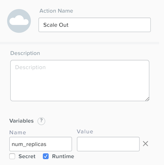

.. _calm_day2：

---------------------------------
Calm：第2天操作（可选）
---------------------------------

概述
++++++++

在：ref：`calm_linux`和：ref：`calm_win`实验室中，您探索了如何使用蓝图来模拟和部署复杂应用程序。然而，Calm，它能够在 **整个** 生命周期中管理应用程序。

**在本实验中，您将在Calm中实施自定义操作以解决“第2天”操作，包括横向扩展，纵向扩展和升级应用程序。**

实验室设置
++++++++++

本实验取决于：ref：`calm_linux`实验室中实现的多层 **Task Manger** Web应用程序的可用性。

如果您已经基本熟悉并且尚未完成：ref：`calm_linux`实验，请参阅：ref：`taskman`实验以获取有关导入基于  **Task Manager** 蓝图的说明。

 **导入后无需启动任务管理器蓝图。**

横向扩展
+++++++++++

假设您是我们正在构建的任务管理器应用程序的管理员，目前，您还不确定最终用户对该应用程序的需求量。或者，你可能认为需求会随着时间的推移而起伏。我们如何轻松扩展以满足这种不断变化的需求？

在创建任务管理器蓝图期间，**WebServer** 服务配置了最少2个副本，最多为4个。因此，Calm将在初始部署期间创建2个WebServer VM。如果2个副本不足以处理最终用户的负载，则需要进行 **Scale Out** 操作。

#. 在 **Application Overview> Application Profile** 部分中，展开 **Default** Application Profile。

   .. figure:: images/510scaleout0.png

#. 选择：fa：`plus-circle`旁边的 **Actions** 添加一个新的自定义动作。在右侧的 **Configuration Pane** 中，将新操作重命名为 **Scale Out**。

   .. figure:: images/510scaleout1.png

#. 在下面的 **below** 的 **WebServer** 服务标签中，单击 **+ Task** 按钮添加扩展任务，并填写以下字段：

   - **Task Name** - web_scale_out
   - **Scaling Type** - Scale Out
   - **Scaling Count** - 1

   .. figure:: images/510scaleout2.png

   .. note::
   
     服务标签下方显示的 **+Task** 按钮仅用于向上和向下缩放副本数量，因此选择正确的选项很重要。

   当用户稍后运行 **Scale Out** 任务时，将创建一个新的 **WebServer**  VM，并将执行该服务的 **Package Install** 任务。但是，我们需要修改 **HAProxy** 配置才能开始利用这个新的Web服务器。

#.  **Within** 的 **HAProxy** 服务标签中，单击 **+Task** 按钮，然后填写以下字段：

   - **Task Name** - add_webserver
   - **Type** - Execute
   - **Script Type** - Shell
   - **Credential** - CENTOS

#. 将以下脚本复制并粘贴到 **Script** 字段中：

 .. code-block:: bash

     #!/bin/bash
     set -ex

     host=$(echo "@@{WebServer.address}@@" | awk -F "," '{print $NF}')
     port=80
     echo " server host-${host} ${host}:${port} weight 1 maxconn 100 check" | sudo tee -a /etc/haproxy/haproxy.cfg

     sudo systemctl daemon-reload
     sudo systemctl restart haproxy

   该脚本将解析WebServer地址数组中的最后一个IP地址，并将其附加到haproxy.cfg文件中。但是，我们希望确保在新的WebServer完全启动后 **after** 不会发生这种情况，否则HAProxy服务器可能会向无法运行的WebServer发送请求。

#. 要解决此问题，请创建边界以强制依赖 **web_scale_out** 任务在 **add_webserver** 任务之前完成。

   您的 **Workspace** 现在应该如下所示：

   .. figure:: images/510scaleout3.png

缩小
++++++++++

在繁忙季节结束后，您希望通过缩减已部署的Web服务器的数量来优化资源利用率。

#. 选择：fa：`plus-circle`将名为 **Scale In** 的自定义动作添加到默认 **Application Profile**。

   .. figure:: images/510scalein1.png

#. 在 **WebServer** 服务标签 **下方**，单击 **+Task** 按钮添加扩展任务，并填写以下字段：

   - **Task Name** - web_scale_in
   - **Scaling Type** - Scale In
   - **Scaling Count** - 1

   .. figure:: images/510scalein2.png

   当用户稍后运行 **Scale In** 任务时，最后一个 **WebServer** 副本将运行其 **Package Uninstall** 任务，VM将被关闭，然后被删除，这将回收资源。但是，我们确实需要修改 **HAProxy** 配置，以确保我们不再向要删除的Web服务器发送流量。

#. **Within** the **HAProxy** service tile, click the **+ Task** button, then fill out the following fields:

   - **Task Name** - del_webserver
   - **Type** - Execute
   - **Script Type** - Shell
   - **Credential** - CENTOS

#. Copy and paste the following script into the **Script** field:

   .. code-block:: bash

     #!/bin/bash
     set -ex

     host=$(echo "@@{WebServer.address}@@" | awk -F "," '{print $NF}')
     sudo sed -i "/$host/d" /etc/haproxy/haproxy.cfg

     sudo systemctl daemon-reload
     sudo systemctl restart haproxy

   Similar to the scale out script, this script will parse the last IP in the WebServer address array and use the `sed <http://www.grymoire.com/Unix/Sed.html>`_ command to remove the corresponding entry from haproxy.cfg.

   Again, similar to the scale out script, we want to ensure requests stop being sent to the VM **before** it is removed.

#. To solve this issue, create an edge to force a dependency on the **del_webserver** task completing prior to the **web_scale_in** task.

   Your **Workspace** should now look like this:

   .. figure:: images/510scalein3.png

#. Click **Save** and ensure no errors or warnings pop-up. If they do, resolve the issue, and **Save** again.

Upgrading
+++++++++

Your company has a mandate to keep all application code up to date, to help minimize security vulnerabilities. Your company also has a strict change control process, meaning you can only update your application during the weekend. You currently spend a significant portion of your time on one Saturday every month completing application update procedures during a maintenance window. Let's look at how you can reclaim your weekend by modeling the application upgrade with Calm.

#. Select :fa:`plus-circle` to add a custom action named **Upgrade** to the Default **Application Profile**.

   The first thing we're going to need to do is to stop the respective processes on each of our Services.

#. **Within each** of our 3 Services, click the **+ Task** button to add a new task, and fill in the following information:

   +------------------+-----------+---------------+-------------+
   | **Service Name** | MySQL     | WebServer     | HAProxy     |
   +------------------+-----------+---------------+-------------+
   | **Task Name**    | StopMySQL | StopWebServer | StopHAProxy |
   +------------------+-----------+---------------+-------------+
   | **Type**         | Execute   | Execute       | Execute     |
   +------------------+-----------+---------------+-------------+
   | **Script Type**  | Shell     | Shell         | Shell       |
   +------------------+-----------+---------------+-------------+
   | **Credential**   | CENTOS    | CENTOS        | CENTOS      |
   +------------------+-----------+---------------+-------------+
   | **Script**       | See Below | See Below     | See Below   |
   +------------------+-----------+---------------+-------------+

   **StopMySQL Script:**

   .. code-block:: bash

      #!/bin/bash
      set -ex

      sudo systemctl stop mysqld

   **StopWebServer Script:**

   .. code-block:: bash

      #!/bin/bash
      set -ex

      sudo systemctl stop php-fpm
      sudo systemctl stop nginx

   **StopHAProxy Script:**

   .. code-block:: bash

      #!/bin/bash
      set -ex

      sudo systemctl stop haproxy

   Once complete, your **Workspace** should look like this:

   .. figure:: images/upgrade1.png

   Similar to both scaling and initial deployment operations, we do not want to get into a situation where the WebServer goes down before the HAProxy, nor do we want the MySQL database to go down before the WebServers.

#. Create edges between services such that HAProxy stops before WebServers, and all WebServers stop before MySQL:

   .. figure:: images/upgrade2.png

   Now that our critical services are stopped, we'll want to perform our updates.

#. Again, **within each** Service, add a new Task.  All of the 3 tasks are identical other than the name:

   +------------------+--------------+------------------+----------------+
   | **Service Name** | MySQL        | WebServer        | HAProxy        |
   +------------------+--------------+------------------+----------------+
   | **Task Name**    | UpgradeMySQL | UpgradeWebServer | UpgradeHAProxy |
   +------------------+--------------+------------------+----------------+
   | **Type**         | Execute      | Execute          | Execute        |
   +------------------+--------------+------------------+----------------+
   | **Script Type**  | Shell        | Shell            | Shell          |
   +------------------+--------------+------------------+----------------+
   | **Credential**   | CENTOS       | CENTOS           | CENTOS         |
   +------------------+--------------+------------------+----------------+
   | **Script**       | See Below    | See Below        | See Below      |
   +------------------+--------------+------------------+----------------+

   **Script for all 3 Upgrade Tasks:**

   .. code-block:: bash

      #!/bin/bash
      set -ex

      sudo yum update -y

   This script will use the Red Hat/CentOS package management tool, `yum <https://access.redhat.com/solutions/9934>`_ to search for and install updates to all installed packages.

   Your **Workspace** should now look like this:

   .. figure:: images/upgrade3.png

   From an a task ordering perspective, do we need to draw any orchestration edges? Notice in the screenshot above that Calm automatically draws and edge from the **Stop** task to the **Upgrade** task, which is good as that's required. However, do we need any side to side dependencies?

   If you said "no", you're correct. The critical components are starting and stopping of the Services, there's no reason to have each Service upgrade one at a time.

   Unless you specify otherwise, Calm will always run tasks in parallel to save time.

   Now that our Services have been upgraded, it's time to start them.

#. Again, we'll add a Task **within each** Service, with the following values:

   +------------------+--------------+------------------+----------------+
   | **Service Name** | MySQL        | WebServer        | HAProxy        |
   +------------------+--------------+------------------+----------------+
   | **Task Name**    | StartMySQL   | StartWebServer   | StartHAProxy   |
   +------------------+--------------+------------------+----------------+
   | **Type**         | Execute      | Execute          | Execute        |
   +------------------+--------------+------------------+----------------+
   | **Script Type**  | Shell        | Shell            | Shell          |
   +------------------+--------------+------------------+----------------+
   | **Credential**   | CENTOS       | CENTOS           | CENTOS         |
   +------------------+--------------+------------------+----------------+
   | **Script**       | See Below    | See Below        | See Below      |
   +------------------+--------------+------------------+----------------+

   **StartMySQL Script:**

   .. code-block:: bash

      #!/bin/bash
      set -ex

      sudo systemctl start mysqld

   **StartWebServer Script:**

   .. code-block:: bash

      #!/bin/bash
      set -ex

      sudo systemctl start php-fpm
      sudo systemctl start nginx

   **StartHAProxy Script:**

   .. code-block:: bash

      #!/bin/bash
      set -ex

      sudo systemctl start haproxy

   Your **Workspace** should now look like this:

   .. figure:: images/upgrade4.png

   This time, we **DO** require additional orchestration edges. As previously discussed, we would not want our HAProxy service up before our WebServers, or our WebServers up before our MySQL database.

#. Create orchestration edges starting with MySQL, then the WebServers, and lastly the HAProxy:

   .. figure:: images/upgrade5.png

#. Click **Save** and ensure no errors or warnings pop-up.  If they do, resolve the issue, and **Save** again.

Launching and Managing the Application
++++++++++++++++++++++++++++++++++++++

#. From the upper toolbar in the Blueprint Editor, click **Launch**.

#. Specify a unique **Application Name** (e.g. *Initials*\ -CalmLinuxIntro1) and your **User_initials** Runtime variable value for VM naming.

#. Click **Create**.

#. Once the application reaches a **Running** status, navigate to the **Manage** tab, and run the **Scale Out** action.

   Changes to the application can be monitored on the **Audit** tab.

   Once the scaling operation has completed, you can log into the HAProxy VM and verify the new Web Server has been added to ``/etc/haproxy/haproxy.cfg``.

#. Run the **Upgrade** action to update each service.

#. Finally, run the **Scale In** action to remove the additional Web Server VM.

(Optional) Variable Scaling
+++++++++++++++++++++++++++

In this lab you configured scaling operations that expanded or shrank the WebServer service array by a single VM.

When creating a new custom action, additional variables can be defined in the Configuration Pane specific to that action.

Leveraging a runtime variable, can you modify the scale out or scale in actions to perform a variable scaling operation?

This will require some bash scripting experience to ensure the appropriate number of entries are being added and/or removed from the haproxy.cfg file.

Takeaways
+++++++++

What are the key things you should know about **Nutanix Calm**?

- Not only can Calm orchestrate complex application deployments, it can manage applications throughout their entire lifecycle, by modeling complex Day 2 operations.

- Whether it's a built in task, like scaling, or a custom task, like upgrades, Calm can be directed to perform the operations in specific order, or if order doesn't matter, perform them in parallel to save on time.

- What operation are you currently doing on a regular basis?  It's likely that it can be modeled in Calm, saving you countless hours.  Take back your weekend!
